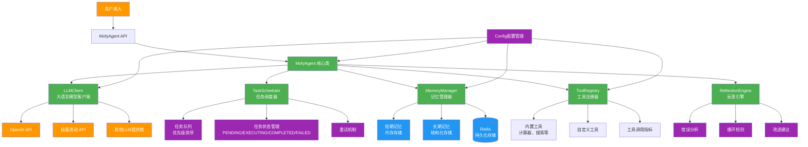
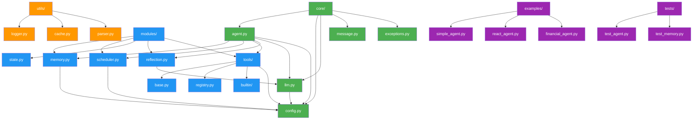

# Mofy Agent Framework

一个轻量级、高性能的Python Agent框架，基于从0到1开发Agent框架的最佳实践构建。

## 特性

- 🚀 **轻量级设计** - 核心依赖最小化，启动速度快
- 🧠 **智能调度** - 基于优先级的任务调度系统
- 💾 **分层记忆** - 短期/长期记忆分离，支持Redis持久化
- 🛠️ **工具系统** - 智能参数解析，支持并行执行
- 🔄 **反思机制** - 自动错误分析和自我改进
- ⚡ **高性能** - 多级缓存、异步执行、批处理优化
- 🌐 **多模型支持** - 支持OpenAI、硅基流动等多种LLM提供商
- 🐳 **Docker支持** - 完整的容器化开发和部署环境

## 快速开始

### 方式1: 本地开发

```bash
# 1. 安装依赖
pip install -r requirements.txt

# 2. 配置环境变量
cp .env.example .env
# 编辑 .env 文件，设置你的API密钥

# 3. 运行示例
python examples/simple_agent.py
```

### 方式2: Docker调试（推荐）

```bash
# Windows用户
scripts\docker-start.bat prod

# Linux/Mac用户
chmod +x scripts/docker-start.sh
./scripts/docker-start.sh prod
```

## Docker调试指南

### 🐳 Docker服务架构

```
┌─────────────────┐    ┌─────────────────┐    ┌─────────────────┐
│   mofy-agent    │    │     Redis       │    │ Redis Commander │
│   (主应用)       │◄──►│   (记忆存储)     │    │   (管理界面)     │
│   :8000         │    │   :6379         │    │   :8081         │
└─────────────────┘    └─────────────────┘    └─────────────────┘
         ▲                       ▲
         │                       │
         ▼                       ▼
┌─────────────────┐    ┌─────────────────┐
│   Jupyter Lab   │    │   mofy-test     │
│  (开发调试)      │    │   (测试服务)     │
│   :8888         │    │                 │
└─────────────────┘    └─────────────────┘
```

### 🚀 快速启动命令

```bash
# 生产环境（包含所有服务）
./scripts/docker-start.sh prod

# 开发环境（热重载+调试）
./scripts/docker-start.sh dev

# 运行测试
./scripts/docker-start.sh test

# 查看服务状态
docker-compose ps

# 查看日志
./scripts/docker-start.sh logs

# 停止所有服务
./scripts/docker-start.sh stop

# 清理所有资源
./scripts/docker-start.sh clean
```

### 🛠️ 开发环境特性

- **热重载**: 代码修改自动重启
- **远程调试**: 支持VS Code调试器连接
- **代码质量检查**: 集成flake8、black、isort
- **单元测试**: pytest + 覆盖率报告
- **性能分析**: memory_profiler + psutil

### 📊 服务访问地址

| 服务 | 地址 | 说明 |
|------|------|------|
| 主应用 | http://localhost:8000 | Mofy Agent Web界面 |
| Redis管理 | http://localhost:8081 | Redis Commander管理界面 |
| Jupyter Lab | http://localhost:8888 | 开发调试环境 |
| Redis | localhost:6379 | 记忆存储服务 |

### 🔧 环境配置

1. **复制环境配置**:
```bash
cp .env.docker .env
```

2. **编辑配置文件**:
```env
# 选择LLM提供商
LLM_PROVIDER=siliconflow
MODEL_NAME=deepseek-ai/DeepSeek-R1-Distill-Qwen-32B
SILICONFLOW_API_KEY=your_api_key_here

# 或使用OpenAI
# LLM_PROVIDER=openai
# MODEL_NAME=gpt-4o
# OPENAI_API_KEY=your_openai_api_key
```

### 🐛 调试配置

#### VS Code远程调试

创建 `.vscode/launch.json`:
```json
{
    "version": "0.2.0",
    "configurations": [
        {
            "name": "Docker Python Debug",
            "type": "python",
            "request": "attach",
            "port": 5678,
            "host": "localhost",
            "pathMappings": [
                {
                    "localRoot": "${workspaceFolder}",
                    "remoteRoot": "/app"
                }
            ]
        }
    ]
}
```

#### 日志调试

```bash
# 查看实时日志
docker-compose logs -f mofy-agent

# 查看特定服务日志
docker-compose logs -f redis

# 查看所有服务日志
docker-compose logs -f
```

## LLM模型配置

### OpenAI模型（默认）
```env
LLM_PROVIDER=openai
MODEL_NAME=gpt-4o
OPENAI_API_KEY=your_openai_api_key
```

### 硅基流动模型
```env
LLM_PROVIDER=siliconflow
MODEL_NAME=deepseek-ai/DeepSeek-R1-Distill-Qwen-32B
SILICONFLOW_API_KEY=your_siliconflow_api_key
SILICONFLOW_BASE_URL=https://api.siliconflow.cn/v1
```

#### 支持的硅基流动模型
- `deepseek-ai/DeepSeek-R1-Distill-Qwen-32B` - DeepSeek R1蒸馏版32B
- `Qwen/Qwen2.5-72B-Instruct` - 通义千问2.5 72B指令版
- `meta-llama/Llama-3.1-70B-Instruct` - Llama 3.1 70B指令版
- `01-ai/Yi-1.5-34B-Chat` - 零一万物34B对话版

#### 获取硅基流动API密钥
1. 访问 [硅基流动官网](https://cloud.siliconflow.cn/)
2. 注册并登录账户
3. 在控制台获取API密钥
4. 将密钥配置到环境变量中

## 核心架构

### 🏗️ 系统架构图



### 🔄 数据流架构


### 📦 模块依赖关系



### 🎯 核心特性说明

#### 1. **智能任务调度**
- 基于优先级的任务队列管理
- 支持任务重试和失败恢复
- 异步任务执行和批处理优化

#### 2. **分层记忆系统**
- **短期记忆**: 内存存储，保存最近对话历史
- **长期记忆**: 结构化知识存储，支持Redis持久化
- **智能检索**: 基于语义相似度的上下文提取

#### 3. **工具生态系统**
- 动态工具注册和参数解析
- 支持并行工具执行
- 内置性能监控和指标收集

#### 4. **自我反思机制**
- 自动错误分析和分类
- 循环检测和避免
- 基于历史经验的改进建议

#### 5. **多模型支持**
- 统一的LLM客户端接口
- 支持OpenAI、硅基流动等多种提供商
- 灵活的模型切换和配置管理

### 🏗️ 系统架构图


### 🔄 数据流架构


### 📦 模块依赖关系


### 🎯 核心特性说明

#### 1. **智能任务调度**
- 基于优先级的任务队列管理
- 支持任务重试和失败恢复
- 异步任务执行和批处理优化

#### 2. **分层记忆系统**
- **短期记忆**: 内存存储，保存最近对话历史
- **长期记忆**: 结构化知识存储，支持Redis持久化
- **智能检索**: 基于语义相似度的上下文提取

#### 3. **工具生态系统**
- 动态工具注册和参数解析
- 支持并行工具执行
- 内置性能监控和指标收集

#### 4. **自我反思机制**
- 自动错误分析和分类
- 循环检测和避免
- 基于历史经验的改进建议

#### 5. **多模型支持**
- 统一的LLM客户端接口
- 支持OpenAI、硅基流动等多种提供商
- 灵活的模型切换和配置管理

## 📚 使用示例

### 基础用法

```python
from mofy import MofyAgent

# 创建Agent实例
agent = MofyAgent()

# 处理用户消息
response = agent.process_message("帮我计算 2+3*4")
print(response)

# 获取Agent状态
status = agent.get_status()
print(f"会话ID: {status['session_id']}")
print(f"待处理任务: {status['pending_tasks']}")
```

### 自定义工具

```python
from mofy.modules.tools.registry import ToolRegistry

# 创建工具注册器
registry = ToolRegistry()

# 定义自定义工具
def weather_query(city: str) -> str:
    """查询天气信息"""
    # 这里可以调用真实的天气API
    return f"{city}今天天气晴朗，温度25°C"

# 注册工具
registry.register_tool(
    name="weather",
    func=weather_query,
    schema={
        "description": "查询城市天气信息",
        "parameters": {
            "type": "object",
            "properties": {
                "city": {
                    "type": "string",
                    "description": "要查询的城市名称"
                }
            },
            "required": ["city"]
        }
    }
)

# 使用工具
result = registry.execute_tool("weather", "北京")
print(result)
```

### 记忆管理

```python
from mofy.modules.memory import MemoryManager

# 创建记忆管理器
memory = MemoryManager()

# 添加对话记录
memory.add_experience("session_123", "用户: 你好")
memory.add_experience("session_123", "助手: 你好！有什么可以帮助你的吗？")

# 获取短期记忆
short_term = memory.get_short_term("session_123")
print(short_term)

# 添加长期知识
memory.add_experience(
    session_id="session_123",
    content="Python是一种高级编程语言",
    is_structured=True,
    key="python_definition"
)

# 获取长期记忆
long_term = memory.get_long_term("python_definition")
print(long_term)
```

### 任务调度

```python
from mofy.modules.scheduler import TaskScheduler

# 创建任务调度器
scheduler = TaskScheduler()

# 添加任务
scheduler.add_task(
    task_type="calculation",
    parameters={"expression": "10*5"},
    priority=1  # 高优先级
)

scheduler.add_task(
    task_type="search",
    parameters={"query": "Python教程"},
    priority=5  # 中等优先级
)

# 执行任务
while True:
    task = scheduler.get_next_task()
    if not task:
        break
    
    print(f"执行任务: {task['type']}")
    # 这里会调用相应的工具执行任务
    
    # 标记任务完成
    scheduler.complete_task(task["task_id"], "任务完成")
```

## 🔧 API 参考

### MofyAgent 类

#### 构造函数
```python
def __init__(self, session_id: str = None)
```
- `session_id`: 可选的会话标识符，如果不提供则自动生成

#### 主要方法

##### process_message(message: str) -> str
处理用户消息并返回回复
- `message`: 用户输入的消息
- 返回: Agent的回复

##### get_status() -> Dict[str, Any]
获取Agent当前状态
- 返回: 包含会话信息、任务状态等的字典

### MemoryManager 类

#### 主要方法

##### add_experience(session_id: str, content: str, is_structured: bool = False, key: str = None)
添加经验到记忆系统
- `session_id`: 会话标识符
- `content`: 记忆内容
- `is_structured`: 是否为结构化知识
- `key`: 结构化知识的键名

##### get_relevant_memory(session_id: str, query: str) -> str
获取与查询相关的记忆片段
- `session_id`: 会话标识符
- `query`: 查询字符串
- 返回: 相关记忆内容

### TaskScheduler 类

#### 主要方法

##### add_task(task_type: str, parameters: Dict[str, Any], priority: int = 5)
添加任务到队列
- `task_type`: 任务类型
- `parameters`: 任务参数
- `priority`: 优先级（1-10，1最高）

##### get_next_task() -> Optional[Dict[str, Any]]
获取下一个待执行任务
- 返回: 任务字典或None

### ToolRegistry 类

#### 主要方法

##### register_tool(name: str, func: Callable, schema: Dict)
注册工具
- `name`: 工具名称
- `func`: 工具函数
- `schema`: 工具参数schema

##### execute_tool(tool_name: str, params: str) -> str
执行工具调用
- `tool_name`: 工具名称
- `params`: 工具参数（字符串格式）
- 返回: 执行结果

## 🧪 测试

### 运行单元测试
```bash
# 运行所有测试
pytest

# 运行特定测试文件
pytest tests/test_agent.py

# 运行测试并生成覆盖率报告
pytest --cov=mofy tests/
```

### 测试覆盖率
```bash
# 生成HTML覆盖率报告
pytest --cov=mofy --cov-report=html tests/

# 查看报告
open htmlcov/index.html
```

## 🚀 部署

### Docker部署
```bash
# 构建镜像
docker build -t mofy-agent .

# 运行容器
docker run -d -p 8000:8000 --name mofy-agent mofy-agent
```

### Docker Compose部署
```bash
# 启动所有服务
docker-compose up -d

# 查看服务状态
docker-compose ps

# 停止服务
docker-compose down
```

## 🤝 贡献指南

1. Fork 本仓库
2. 创建特性分支: `git checkout -b feature/amazing-feature`
3. 提交更改: `git commit -m 'Add amazing feature'`
4. 推送分支: `git push origin feature/amazing-feature`
5. 提交Pull Request

### 开发规范
- 遵循PEP 8代码风格
- 添加适当的单元测试
- 更新相关文档
- 确保所有测试通过

## 📄 许可证

本项目采用 MIT 许可证 - 查看 [LICENSE](LICENSE) 文件了解详情

## 🙏 致谢

- 感谢所有贡献者的支持
- 参考了优秀的开源Agent框架设计
- 特别感谢从0到1开发Agent框架系列教程的启发

## 📞 联系方式

- 项目主页: [GitHub Repository](https://github.com/your-username/mofy)
- 问题反馈: [Issues](https://github.com/your-username/mofy/issues)
- 文档: [Wiki](https://github.com/your-username/mofy/wiki)

---

⭐ 如果这个项目对你有帮助，请给我们一个Star！